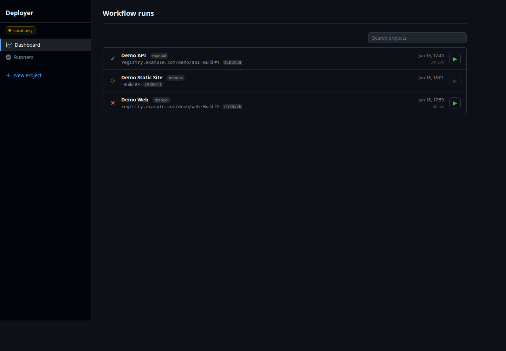
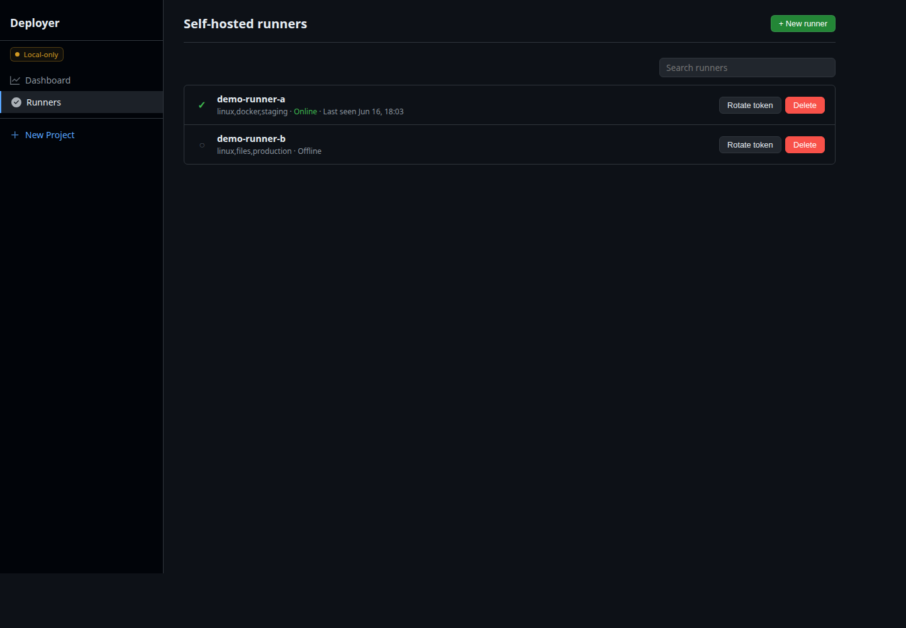
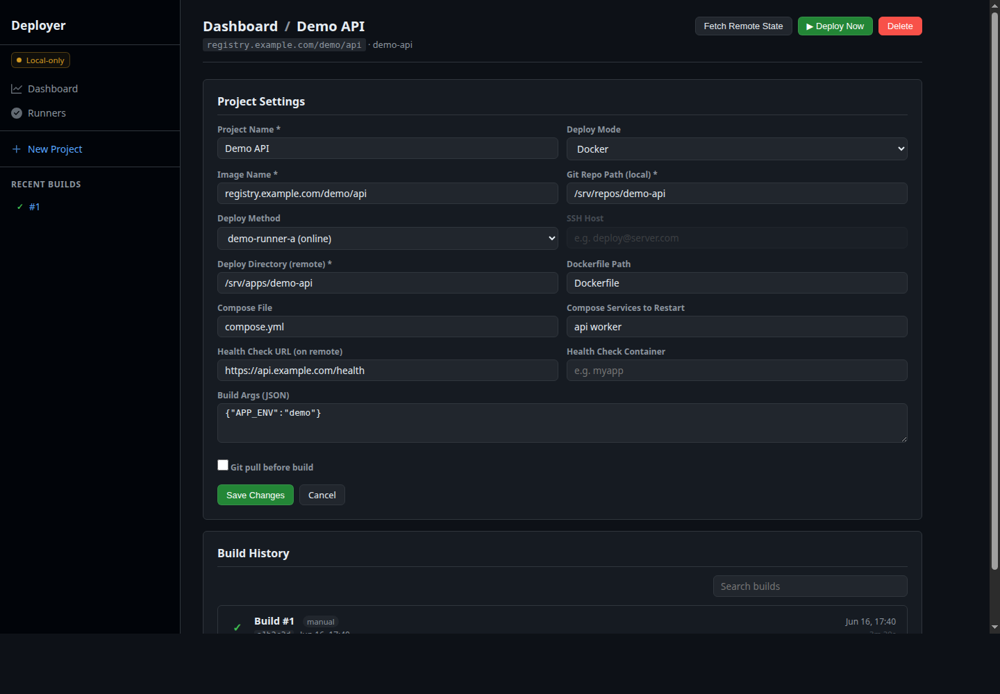

# Deployer

Deployer is a small self-hosted CI/CD tool written in Go. It runs as a single
binary with an embedded web UI, a SQLite database, live build logs over SSE, and
polling agents for remote machines.

The project is intended for maintainers who want a lightweight deployment
control plane without running a full CI system.

## Status

This repository is being prepared for a first public release. Review
`TODO.md` before using it for production workloads.

## Features

- Single Go binary with embedded HTML/CSS/JavaScript.
- SQLite storage.
- Docker deploy mode: build an image, transfer it to a runner, load it, and
  restart Docker Compose services.
- Files deploy mode: package files, transfer them to a runner, preserve selected
  paths, apply optional permissions, and run an optional post-deploy command.
- Remote snapshots: ask a runner to package the current deploy directory and
  upload it back to the server.
- Live build logs with collapsible steps.
- Runner auto-update from the server binary.

## Screenshots

The screenshots below use demo data only.







## Security Model

Deployer can execute commands and write files on every configured runner. Treat
server admin access and runner tokens as privileged production credentials.

By default, the server binds to `127.0.0.1:9090`. If you bind to a non-loopback
address, `DEPLOYER_ADMIN_PASSWORD` is required.

Recommended production setup:

- Put the server behind HTTPS.
- Set `DEPLOYER_ADMIN_PASSWORD`.
- Use a reverse proxy with request-size limits appropriate for your artifacts.
- Keep runner tokens out of URLs, logs, shell history, and screenshots.
- Do not publish `deployer.db`, logs, generated binaries, or local config files.

## Installation

Prerequisites:

- Linux host for server and runners.
- Go 1.25 or newer for development. Release checks currently use Go 1.26.4.
- Git for source checkout and optional `git pull` before deploys.
- Docker with the Compose plugin for Docker mode.
- `tar`, `gzip`, `curl`, `ssh`, and `scp` for agent and remote operations.
- systemd if you use the example service units.

```bash
go build -o deployer ./cmd/deployer
DEPLOYER_ADMIN_PASSWORD='change-me' ./deployer
```

Open `http://127.0.0.1:9090` and authenticate with:

- User: `admin` unless `DEPLOYER_ADMIN_USER` is set.
- Password: `DEPLOYER_ADMIN_PASSWORD`.

## Configuration

| Variable | Default | Description |
| --- | --- | --- |
| `DEPLOYER_ADDR` | `127.0.0.1:9090` | HTTP listen address. |
| `DEPLOYER_DB_PATH` | `deployer.db` | SQLite database path. |
| `DEPLOYER_ADMIN_USER` | `admin` | Basic Auth username. |
| `DEPLOYER_ADMIN_PASSWORD` | empty | Basic Auth password. Required for non-loopback binds. |
| `DEPLOYER_PUBLIC_URL` | empty | Public URL used in generated runner setup commands. |
| `DEPLOYER_ARTIFACT_DIR` | `/tmp/deployer-artifacts` | Managed server-side build artifact directory. |
| `DEPLOYER_SNAPSHOT_DIR` | `/tmp/deployer-snapshots` | Managed server-side snapshot artifact directory. |
| `DEPLOYER_ARTIFACT_RETENTION_HOURS` | `24` | Age after which stale artifact files are removed. |
| `DEPLOYER_LOG_RETENTION_DAYS` | `30` | Age after which stored build logs are cleared. |
| `DEPLOYER_DOCKER_PRUNE` | `false` | Enables broad Docker image/builder prune after deploys. |
| `DEPLOYER_AGENT_AUTO_UPDATE` | `false` | Enables checksum-verified agent self-update. Agent-side setting. |
| `DEPLOYER_SERVER_READ_TIMEOUT` | `30s` | Server request read timeout. |
| `DEPLOYER_SERVER_WRITE_TIMEOUT` | `5m` | Server response write timeout. SSE streams send heartbeats to stay active. |
| `DEPLOYER_DOCKER_BUILD_TIMEOUT` | `15m` | Docker build timeout. |
| `DEPLOYER_SCP_TIMEOUT` | `10m` | Remote SCP transfer timeout. |
| `DEPLOYER_SSH_TIMEOUT` | `5m` | Remote SSH deploy timeout. |
| `DEPLOYER_HEALTH_CHECK_TIMEOUT` | `60s` | Health-check timeout. |
| `DEPLOYER_DEMO_MODE` | `false` | Seeds public-safe demo projects, runners, and builds into an empty database for screenshots. |
| `DEPLOYER_AGENT_CONTROL_TIMEOUT` | `45s` | Agent heartbeat, poll, log, completion, and version-check HTTP timeout. Agent-side setting. |
| `DEPLOYER_AGENT_ARTIFACT_TIMEOUT` | `30m` | Agent artifact download/upload/update HTTP timeout. Agent-side setting. |

See `.env.example` for a starter environment file.

## Running As A Service

Example user service:

```ini
[Unit]
Description=Deployer
After=network-online.target

[Service]
Type=simple
WorkingDirectory=/opt/deployer
ExecStart=/opt/deployer/deployer
Restart=always
RestartSec=3
Environment=DEPLOYER_ADDR=127.0.0.1:9090
Environment=DEPLOYER_DB_PATH=/var/lib/deployer/deployer.db
Environment=DEPLOYER_ARTIFACT_DIR=/var/lib/deployer/artifacts
Environment=DEPLOYER_SNAPSHOT_DIR=/var/lib/deployer/snapshots
Environment=DEPLOYER_ARTIFACT_RETENTION_HOURS=24
Environment=DEPLOYER_LOG_RETENTION_DAYS=30
Environment=DEPLOYER_SERVER_READ_TIMEOUT=30s
Environment=DEPLOYER_SERVER_WRITE_TIMEOUT=5m
Environment=DEPLOYER_DOCKER_BUILD_TIMEOUT=15m
Environment=DEPLOYER_SCP_TIMEOUT=10m
Environment=DEPLOYER_SSH_TIMEOUT=5m
Environment=DEPLOYER_HEALTH_CHECK_TIMEOUT=60s
Environment=DEPLOYER_ADMIN_USER=admin
Environment=DEPLOYER_ADMIN_PASSWORD=change-me
Environment=DEPLOYER_PUBLIC_URL=https://deployer.example.com

[Install]
WantedBy=default.target
```

## Runner Setup

Create a runner from the **Runners** page. The setup command is shown once and
includes the runner token.

Agents authenticate with:

```text
Authorization: Bearer <runner-token>
```

The token is stored in `/etc/deployer/deployer-agent.env` in the generated
systemd example. Keep that file mode `0600`.

Generated setup commands prompt for the token rather than embedding it directly,
which keeps it out of pasted command examples and shell history.

## Deploy Modes

### Docker Mode

Server-side:

1. Optionally run `git pull`.
2. Read the current commit SHA.
3. Build a Docker image.
4. Save the image to a tar artifact.
5. Create a runner job.

Runner-side:

1. Download the image artifact.
2. Run `docker load`.
3. Restart configured Docker Compose services.
4. Run optional health checks.

### Files Mode

Server-side:

1. Optionally run `git pull`.
2. Package repository files into `tar.gz`.
3. Create a runner job.

Runner-side:

1. Download the archive.
2. Back up configured preserve paths.
3. Extract files into `deploy_dir`.
4. Restore preserve paths.
5. Apply optional ownership and permissions.
6. Run optional post-deploy command.
7. Run optional health checks.

## Ignore Files

Files mode reads `.deployignore` from the source repository. If missing, it
falls back to `.dockerignore`.

The matcher currently uses Go `filepath.Match`-style patterns rather than full
`.gitignore` semantics.

Example:

```text
node_modules
*.log
.env
.git
```

## API Overview

Admin UI/API routes require Basic Auth when `DEPLOYER_ADMIN_PASSWORD` is set.
Browser state-changing requests also include `X-Deployer-CSRF: 1`.

Agent routes require `Authorization: Bearer <runner-token>`.

See `docs/openapi.yaml` for a machine-readable OpenAPI reference with request
and response examples.

Failed or cancelled builds and jobs include stable `error_code` fields for
runtime failures such as `artifact_failed`, `health_check_failed`,
`runner_offline`, and `cancelled`. API clients should use those fields instead
of parsing `error_message`.

HTML:

- `GET /`
- `GET /projects/new`
- `GET /projects/:id`
- `GET /builds/:id`
- `GET /runners`

Admin API:

- `GET /api/capabilities`
- `GET /api/projects`
- `POST /api/projects`
- `POST /api/projects/import`
- `GET /api/projects/:id`
- `GET /api/projects/:id/summary`
- `GET /api/projects/:id/preview`
- `GET /api/projects/:id/runbook`
- `GET /api/projects/:id/autodetect`
- `GET /api/projects/:id/history`
- `GET /api/projects/:id/export`
- `POST /api/projects/:id/clone`
- `PUT /api/projects/:id`
- `DELETE /api/projects/:id`
- `POST /api/projects/:id/deploy`
- `POST /api/projects/:id/snapshot`
- `GET /api/builds/:id`
- `GET /api/builds/:id/stream`
- `GET /api/builds/:id/events`
- `GET /api/builds/:id/failure-summary`
- `GET /api/builds/:id/release-notes`
- `GET /api/builds/:id/annotations`
- `POST /api/builds/:id/annotations`
- `DELETE /api/builds/:id/annotations/:annotationId`
- `POST /api/builds/:id/cancel`
- `GET /api/builds/:id/artifact`
- `GET /api/runners`
- `POST /api/runners`
- `GET /api/runners/:id`
- `GET /api/runners/:id/history`
- `POST /api/runners/:id/rotate`
- `DELETE /api/runners/:id`

Agent API:

- `GET /api/agent/poll`
- `GET /api/agent/artifact/:buildId`
- `POST /api/agent/snapshot/:buildId`
- `POST /api/agent/log/:buildId`
- `POST /api/agent/complete/:buildId`
- `POST /api/agent/heartbeat`

Agent-accessible release endpoints:

- `GET /api/version`
- `GET /download/deployer`

Project exports use a `deployer.project` envelope. Runtime bindings and likely
secret-bearing values are intentionally left out: runner assignment,
post-deploy shell commands, and build args whose names or values look sensitive.
The response includes `omitted_fields` so operators can review and re-enter
environment-specific values after import.

## Project Field Validation

Project configuration is trusted admin input, but the server rejects several
dangerous values before jobs are created:

- `deploy_dir` must not be empty or `/`.
- `dockerfile_path` and `compose_file` must be relative paths and must not
  traverse outside the project.
- `health_url` must be `http` or `https` and include a host.
- `image_name`, `health_container`, `compose_services`, and `ssh_host` reject
  shell-sensitive characters.
- `preserve` paths and permission patterns must be relative paths.
- `permissions` must be valid JSON with octal modes and safe owner names.

Example permissions JSON:

```json
{
  "owner": "www-data:www-data",
  "files": {
    "*.php": "0644"
  },
  "dirs": {
    "storage": "0775"
  }
}
```

`post_deploy` is privileged code execution on the runner. Only configure it for
projects and operators you trust. Fixed deploy steps use structured command
arguments; `post_deploy` is the intentional shell-script escape hatch for
operator-defined commands.

## Files Mode Safety

Files mode creates a `tar.gz` archive from the source repository and extracts it
on the runner. Extraction rejects absolute paths, `../` traversal, symlinks,
device files, and unsupported archive entry types.

Preserve paths are backed up before extraction and restored afterward. Preserve
entries are relative to `deploy_dir`; absolute paths and traversal are rejected.

Packaging can still record symlinks from the source tree. Review `TODO.md`
before relying on files mode for untrusted repositories.

## Snapshots

Snapshots ask a runner to package its current `deploy_dir` and upload the
archive to the server. Snapshot artifacts may contain secrets from deployed
applications, so restrict artifact access, keep request-size limits high enough
for expected snapshots, and delete old snapshots according to your retention
policy.

## Auto-Update

Agent self-update is disabled by default. Set `DEPLOYER_AGENT_AUTO_UPDATE=true`
or pass `--auto-update` to opt in.

When enabled, agents check `/api/version` and download `/download/deployer` when
the server version changes. The endpoint requires either admin auth or a valid
runner bearer token. The agent verifies the downloaded binary against the
`checksum_sha256` value returned by `/api/version`, stages it next to the
current executable, atomically swaps it into place, and keeps the previous
binary as `<name>.old`.

After installing an update, the agent exits and expects an external process
manager such as systemd to restart it. Binary signing and configurable update
channels are still tracked in `TODO.md`.

## Database Operations

SQLite uses WAL mode. The default database path is `deployer.db`, and the
recommended service path is `/var/lib/deployer/deployer.db`. New timestamps are
stored as UTC RFC3339 values. Build artifacts and snapshots are stored in
`DEPLOYER_ARTIFACT_DIR` and `DEPLOYER_SNAPSHOT_DIR`.

Back up the database while the server is stopped, or use SQLite's online backup
tooling so the `deployer.db`, `deployer.db-wal`, and `deployer.db-shm` state is
captured consistently.

Example stopped backup:

```bash
systemctl --user stop deployer
cp /var/lib/deployer/deployer.db /var/backups/deployer.db
systemctl --user start deployer
```

Restore by stopping the service, replacing the database file with a known-good
backup, and starting the service again. Do not publish database backups.

Persisted build logs are capped at 4 MiB per build. By default, stale artifact
files are removed after 24 hours and build logs are cleared after 30 days. Set
`DEPLOYER_ARTIFACT_RETENTION_HOURS=0` or `DEPLOYER_LOG_RETENTION_DAYS=0` to
disable those cleanup policies.

## Reverse Proxy

For internet-facing use, terminate HTTPS at a reverse proxy and forward to the
loopback listener. Configure:

- HTTPS with modern TLS settings.
- Request-size limits large enough for Docker image artifacts and snapshots.
- Proxy read timeouts longer than agent long-polling and large artifact
  transfers.
- Access logs that do not record Authorization headers.
- Optional additional authentication such as SSO or a VPN.

## Operational Recovery

On startup, running builds are marked cancelled and unfinished jobs are marked
failed. If a deploy is interrupted, inspect the build log, runner service logs,
and target Docker Compose state before retrying.

Temporary artifacts are written under the managed artifact directories and are
cleaned periodically according to `DEPLOYER_ARTIFACT_RETENTION_HOURS`. Clean
stale files manually after crashes only once you have confirmed no active build
needs them.

## Migration Policy

Current schema changes are applied from code at startup by named, idempotent
migrations recorded in the `schema_migrations` table. Future public releases
should document migrations in the changelog and avoid destructive schema changes
without an explicit backup step.

## Development

```bash
go test ./...
go vet ./...
go test -race ./...
go run golang.org/x/vuln/cmd/govulncheck@v1.3.0 ./...
```

Use a temporary database for local development:

```bash
DEPLOYER_DB_PATH=/tmp/deployer-dev.db go run ./cmd/deployer
```

Seed public-safe screenshot data into an empty temporary database:

```bash
DEPLOYER_DEMO_MODE=true DEPLOYER_DB_PATH=/tmp/deployer-demo.db go run ./cmd/deployer
```

## Repository Layout

- `cmd/deployer` contains the binary entrypoint.
- `internal/app` contains the server, agent, storage, builder, handlers, and
  package tests.
- `internal/app/web` contains embedded templates and static assets.
- `docs` contains OpenAPI documentation and public-safe screenshots.

## Release Checklist

Before publishing a release:

- Build with a patched Go toolchain.
- Run tests, race tests, vet, and `govulncheck`.
- Confirm no databases, binaries, unreviewed screenshots, logs, keys, `.env`
  files, or machine-specific configs are present.
- Rotate any token that was ever present in screenshots, logs, local databases,
  or shell history.
- Review `TODO.md` for remaining security and reliability work.

Manual release process:

1. Create a clean Git worktree with only source and public-safe documentation.
2. Run the release checks listed above.
3. Tag the release and build binaries from the tag.
4. Publish checksums with the binaries.
5. Update `CHANGELOG.md`.

## Roadmap

The immediate roadmap is public-release hardening: token rotation, signed
updates, artifact retention, broader test coverage, and clearer operations docs.
Longer-term product ideas such as webhooks, rollback, project templates, and AI
tooling are tracked separately in `TODO.md`.
