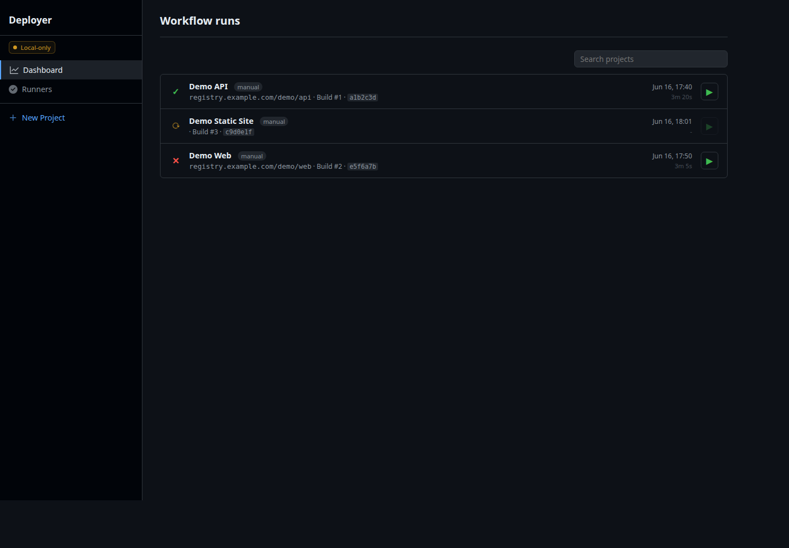
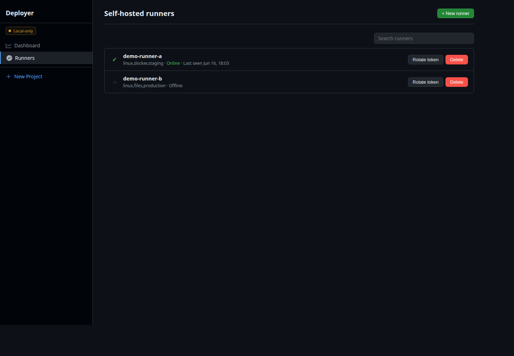
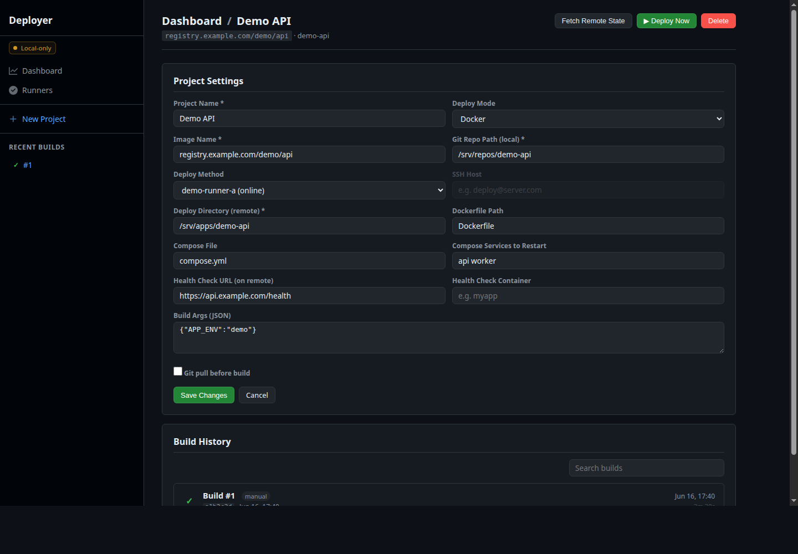

# Deployer

Deployer is a small self-hosted CI/CD tool written in Go. It runs as a single
binary with an embedded web UI, a SQLite database, live build logs over SSE, and
polling agents for remote machines.

The project is intended for maintainers who want a lightweight deployment
control plane without running a full CI system.

## Status

This repository is being prepared for a first public release. Review
`TODO.md` before using it for production workloads.

## Features

- Single Go binary with embedded HTML/CSS/JavaScript.
- SQLite storage.
- Docker deploy mode: build an image, transfer it to a runner, load it, and
  restart Docker Compose services.
- Files deploy mode: package files, transfer them to a runner, preserve selected
  paths, apply optional permissions, and run an optional post-deploy command.
- Remote snapshots: ask a runner to package the current deploy directory and
  upload it back to the server.
- Live build logs with collapsible steps.
- Runner auto-update from the server binary.

## Screenshots

The screenshots below use demo data only.







## Security Model

Deployer can execute commands and write files on every configured runner. Treat
server admin access and runner tokens as privileged production credentials.

By default, the server binds to `127.0.0.1:9090`. If you bind to a non-loopback
address, protect the UI/API with an upstream authorization gateway. Deployer no
longer implements local admin password login; direct network access to the
UI/API is admin access.

Recommended production setup:

- Put the server behind HTTPS and an authorization gateway.
- This deployment uses [Pocket ID](https://github.com/pocket-id/pocket-id) as
  the upstream OIDC authorization gateway.
- Bind Deployer to loopback or a private interface unless the gateway controls
  all public entry points.
- Use a reverse proxy with request-size limits appropriate for your artifacts.
- Keep runner tokens out of URLs, logs, shell history, and screenshots.
- Do not publish `deployer.db`, logs, generated binaries, or local config files.

## Installation

Prerequisites:

- Linux host for server and runners.
- Go 1.25 or newer for development. Release checks currently use Go 1.26.4.
- Git for source checkout and optional `git pull` before deploys.
- Docker with the Compose plugin for Docker mode.
- `tar`, `gzip`, `curl`, `ssh`, and `scp` for agent and remote operations.
- systemd if you use the example service units.

```bash
go build -o deployer ./cmd/deployer
./deployer
```

Open `http://127.0.0.1:9090` for local development, or access the production
URL through your authorization gateway.

## Configuration

| Variable | Default | Description |
| --- | --- | --- |
| `DEPLOYER_ADDR` | `127.0.0.1:9090` | HTTP listen address. |
| `DEPLOYER_DB_PATH` | `deployer.db` | SQLite database path. |
| `DEPLOYER_PUBLIC_URL` | empty | Public URL used in generated runner setup commands. |
| `DEPLOYER_ARTIFACT_DIR` | `/tmp/deployer-artifacts` | Managed server-side build artifact directory. |
| `DEPLOYER_SNAPSHOT_DIR` | `/tmp/deployer-snapshots` | Managed server-side snapshot artifact directory. |
| `DEPLOYER_ARTIFACT_RETENTION_HOURS` | `24` | Age after which stale artifact files are removed. |
| `DEPLOYER_LOG_RETENTION_DAYS` | `30` | Age after which stored build logs are cleared. |
| `DEPLOYER_DOCKER_PRUNE` | `false` | Enables broad Docker image/builder prune after deploys. |
| `DEPLOYER_AGENT_AUTO_UPDATE` | `false` | Enables checksum-verified agent self-update. Agent-side setting. |
| `DEPLOYER_SERVER_READ_TIMEOUT` | `30s` | Server request read timeout. |
| `DEPLOYER_SERVER_WRITE_TIMEOUT` | `5m` | Server response write timeout. SSE streams send heartbeats to stay active. |
| `DEPLOYER_DOCKER_BUILD_TIMEOUT` | `15m` | Docker build timeout. |
| `DEPLOYER_SCP_TIMEOUT` | `10m` | Remote SCP transfer timeout. |
| `DEPLOYER_SSH_TIMEOUT` | `5m` | Remote SSH deploy timeout. |
| `DEPLOYER_HEALTH_CHECK_TIMEOUT` | `60s` | Health-check timeout. |
| `DEPLOYER_DEMO_MODE` | `false` | Seeds public-safe demo projects, runners, and builds into an empty database for screenshots. |
| `DEPLOYER_HOSTING_DEPLOY_ROOT` | `/srv/deployer/hosting/apps` | Base directory used to derive hosted-project deploy paths. The API never accepts an arbitrary deploy path. |
| `DEPLOYER_HOSTING_SOURCE_BROKER_URL` | empty | Fixed private source-broker origin. HTTPS is required except for loopback tests; redirects are rejected. |
| `DEPLOYER_HOSTING_SOURCE_BROKER_TOKEN` | empty | Dedicated source-broker bearer credential. Never written to the database or logs. |
| `DEPLOYER_HOSTING_SOURCE_BROKER_TIMEOUT` | `4m` | Exact-source download timeout; must remain shorter than the server write timeout. |
| `DEPLOYER_HOSTING_SOURCE_MAX_BYTES` | `536870912` | Maximum accepted source tar size in bytes. |
| `DEPLOYER_HOSTING_WORKLOAD_IDENTITY_SECRET` | empty | Server-side HMAC key used only for 90-second secret-broker workload identities; use at least 32 random bytes. |
| `DEPLOYER_PROXY_ADAPTER_URL` | empty | Colleague-owned versioned reverse-proxy adapter URL. HTTPS is required except for loopback development. |
| `DEPLOYER_PROXY_ADAPTER_TOKEN` | empty | Private adapter bearer credential. Never written to the database or logs. |
| `DEPLOYER_PROXY_ADAPTER_TIMEOUT` | `15s` | Activation/suspension adapter request timeout. |
| `DEPLOYER_HOSTING_CALLBACK_URL` | empty | Hosting control-plane terminal callback URL. HTTPS is required except for loopback tests. |
| `DEPLOYER_HOSTING_CALLBACK_SECRET` | empty | HMAC callback key; use at least 32 random bytes. |
| `DEPLOYER_HOSTING_CALLBACK_TIMEOUT` | `15s` | Per-attempt callback timeout, capped at 60 seconds to leave a safety margin inside the two-minute delivery lease. |
| `DEPLOYER_HOSTING_CALLBACK_MAX_ATTEMPTS` | `12` | Attempts before a callback enters `dead_letter`. |
| `DEPLOYER_SERVICE_TOKEN_ROTATION_OVERLAP` | `24h` | Validity overlap retained for the prior service-token credential during rotation; set `0s` for immediate expiry. |
| `DEPLOYER_HOSTING_LOG_RETENTION_DAYS` | `30` | Hosting log retention; `0` disables deletion. |
| `DEPLOYER_HOSTING_EVENT_RETENTION_DAYS` | `90` | Hosting event retention; `0` disables deletion. |
| `DEPLOYER_HOSTING_RELEASE_RETENTION_DAYS` | `90` | Inactive/failed release retention; active releases are never aged out. |
| `DEPLOYER_HOSTING_CALLBACK_RETENTION_DAYS` | `30` | Delivered/dead-letter callback retention. |
| `DEPLOYER_HOSTING_AUDIT_RETENTION_DAYS` | `365` | Hosting and service-token audit retention. |
| `DEPLOYER_AGENT_CONTROL_TIMEOUT` | `45s` | Agent heartbeat, poll, log, completion, and version-check HTTP timeout. Agent-side setting. |
| `DEPLOYER_AGENT_ARTIFACT_TIMEOUT` | `30m` | Agent artifact download/upload/update HTTP timeout. Agent-side setting. |
| `DEPLOYER_HOSTING_AGENT_WORK_ROOT` | `/tmp/deployer-hosting-agent` | Absolute dedicated hosting-agent work root. One agent process exclusively locks each root. Agent-side setting. |
| `DEPLOYER_HOSTING_AGENT_RUNTIME_BIND_ADDRESS` | `127.0.0.1` | Loopback or private IPv4 address reachable by the staging/production proxy adapter; public binds are rejected. |
| `DEPLOYER_HOSTING_AGENT_BUILD_NETWORK` | required | Docker internal network labeled `light-apps.hosting.restricted-egress=true` and connected only to approved package mirrors. |
| `DEPLOYER_HOSTING_AGENT_BUILD_TIMEOUT` | `15m` | Hard customer-build deadline; accepted range is 1–60 minutes. |
| `DEPLOYER_HOSTING_SECRET_BROKER_URL` | empty | Agent-side fixed private workload-secret broker origin. HTTPS is required except for loopback tests; redirects are rejected. |
| `DEPLOYER_HOSTING_SECRET_BROKER_TIMEOUT` | `15s` | Agent-side workload-secret redemption timeout; accepted range is greater than zero through one minute. |
| `DEPLOYER_HOSTING_AGENT_DRAINING` | `false` | Advertise drain and stop claiming new hosting work. Agent-side setting. |

One Deployer process exclusively owns each configured SQLite database. Startup
takes an OS lock on `DEPLOYER_DB_PATH` itself and fails closed on contention,
including symlink or hard-link aliases. In-memory server databases are rejected.
Give that database dedicated artifact and snapshot directories; this invariant
coordinates idempotent source acquisition with artifact cleanup.

See `.env.example` for a starter environment file.

## Running As A Service

Example user service:

```ini
[Unit]
Description=Deployer
After=network-online.target

[Service]
Type=simple
WorkingDirectory=/opt/deployer
ExecStart=/opt/deployer/deployer
Restart=always
RestartSec=3
Environment=DEPLOYER_ADDR=127.0.0.1:9090
Environment=DEPLOYER_DB_PATH=/var/lib/deployer/deployer.db
Environment=DEPLOYER_ARTIFACT_DIR=/var/lib/deployer/artifacts
Environment=DEPLOYER_SNAPSHOT_DIR=/var/lib/deployer/snapshots
Environment=DEPLOYER_ARTIFACT_RETENTION_HOURS=24
Environment=DEPLOYER_LOG_RETENTION_DAYS=30
Environment=DEPLOYER_SERVER_READ_TIMEOUT=30s
Environment=DEPLOYER_SERVER_WRITE_TIMEOUT=5m
Environment=DEPLOYER_DOCKER_BUILD_TIMEOUT=15m
Environment=DEPLOYER_SCP_TIMEOUT=10m
Environment=DEPLOYER_SSH_TIMEOUT=5m
Environment=DEPLOYER_HEALTH_CHECK_TIMEOUT=60s
Environment=DEPLOYER_PUBLIC_URL=https://deployer.example.com

[Install]
WantedBy=default.target
```

## Runner Setup

Create a runner from the **Runners** page. The setup command is shown once and
includes the runner token.

Agents authenticate with:

```text
Authorization: Bearer <runner-token>
```

The token is stored in `/etc/deployer/deployer-agent.env` in the generated
systemd example. Keep that file mode `0600`.

Generated setup commands prompt for the token rather than embedding it directly,
which keeps it out of pasted command examples and shell history.

## Deploy Modes

### Docker Mode

Server-side:

1. Optionally run `git pull`.
2. Read the current commit SHA.
3. Build a Docker image.
4. Save the image to a tar artifact.
5. Create a runner job.

Runner-side:

1. Download the image artifact.
2. Run `docker load`.
3. Restart configured Docker Compose services.
4. Run optional health checks.

### Files Mode

Server-side:

1. Optionally run `git pull`.
2. Package repository files into `tar.gz`.
3. Create a runner job.

Runner-side:

1. Download the archive.
2. Back up configured preserve paths.
3. Extract files into `deploy_dir`.
4. Restore preserve paths.
5. Apply optional ownership and permissions.
6. Run optional post-deploy command.
7. Run optional health checks.

## Ignore Files

Files mode reads `.deployignore` from the source repository. If missing, it
falls back to `.dockerignore`.

The matcher currently uses Go `filepath.Match`-style patterns rather than full
`.gitignore` semantics.

Example:

```text
node_modules
*.log
.env
.git
```

## API Overview

Admin UI/API routes rely on the upstream authorization gateway. Browser
state-changing requests also include `X-Deployer-CSRF: 1`.

Agent routes require `Authorization: Bearer <runner-token>`.

Private control-plane routes require a scoped Deployer service token. Create
the token through the admin API; its plaintext value is returned only once and
is stored hashed. Customer-facing applications must not call these routes
directly.

See `docs/openapi.yaml` for a machine-readable OpenAPI reference with request
and response examples.

Failed or cancelled builds and jobs include stable `error_code` fields for
runtime failures such as `artifact_failed`, `health_check_failed`,
`runner_offline`, and `cancelled`. API clients should use those fields instead
of parsing `error_message`.

HTML:

- `GET /`
- `GET /projects/new`
- `GET /projects/:id`
- `GET /builds/:id`
- `GET /runners`

Admin API:

- `GET /api/capabilities`
- `GET /api/projects`
- `POST /api/projects`
- `POST /api/projects/import`
- `GET /api/projects/:id`
- `GET /api/projects/:id/summary`
- `GET /api/projects/:id/preview`
- `GET /api/projects/:id/runbook`
- `GET /api/projects/:id/autodetect`
- `GET /api/projects/:id/history`
- `GET /api/projects/:id/export`
- `POST /api/projects/:id/clone`
- `PUT /api/projects/:id`
- `DELETE /api/projects/:id`
- `POST /api/projects/:id/deploy`
- `POST /api/projects/:id/snapshot`
- `GET /api/builds/:id`
- `GET /api/builds/:id/stream`
- `GET /api/builds/:id/events`
- `GET /api/builds/:id/failure-summary`
- `GET /api/builds/:id/release-notes`
- `GET /api/builds/:id/annotations`
- `POST /api/builds/:id/annotations`
- `DELETE /api/builds/:id/annotations/:annotationId`
- `POST /api/builds/:id/cancel`
- `GET /api/builds/:id/artifact`
- `GET /api/runners`
- `POST /api/runners`
- `GET /api/runners/:id`
- `GET /api/runners/:id/history`
- `POST /api/runners/:id/rotate`
- `DELETE /api/runners/:id`
- `GET /api/service-tokens`
- `POST /api/service-tokens`
- `GET /api/service-tokens/:id`
- `POST /api/service-tokens/:id/rotate`
- `DELETE /api/service-tokens/:id`

Private control-plane API:

- `PUT /api/internal/v1/projects/:externalProjectId`
- `POST /api/internal/v1/projects/:externalProjectId/deployments`
- `GET /api/internal/v1/deployments/:externalDeploymentId`
- `POST /api/internal/v1/deployments/:externalDeploymentId/cancel`
- `GET /api/internal/v1/deployments/:externalDeploymentId/events`
- `GET /api/internal/v1/deployments/:externalDeploymentId/logs`
- `GET /api/internal/v1/projects/:externalProjectId/releases`
- `POST /api/internal/v1/projects/:externalProjectId/rollback`
- `POST /api/internal/v1/projects/:externalProjectId/suspend`
- `POST /api/internal/v1/projects/:externalProjectId/resume`
- `PUT /api/internal/v1/projects/:externalProjectId/kill-switch`
- `PUT /api/internal/v1/settings/kill-switch`
- `GET /api/internal/v1/capabilities`
- `GET /api/internal/v1/runners`
- `GET /api/internal/v1/metrics`

Authenticated deployment polling and release history return the private
runner-authoritative `runtime_endpoint` and redacted `health_evidence` after a
runner reports an endpoint that passes Deployer validation and health gating.
The endpoint is intended for private control-plane verification and recovery;
it is not a public customer URL.

Rollback selects an immutable release instance with both its
`external_deployment_id` and `release_digest`; a digest alone is intentionally
insufficient because content-identical deployments can have distinct runtime
instances. Admission atomically binds one pending idempotency receipt to that
exact release and request hash. In `proxy_v1` it also binds the routing
generation before health or adapter calls. In `runtime_only_v1` it instead
binds the exact inactive runner session, runtime instance and endpoint, then
health-gates and atomically swaps the authoritative active release without a
proxy operation, route generation, route revision or adapter call. An exact
retry while pending returns `409 idempotency_in_progress`; a
different request with the same key returns `409 idempotency_conflict`, and
neither retry creates new work. For `proxy_v1`, a `503` leaves the admitted rollback
pending, so retain and retry only the same key. Pending rollback receipts do not
expire. Once reconciliation records a completed success or terminal error, its
status and body are retained for 24 hours and a replay returns
`Idempotency-Replayed: true`.
After any ambiguous transport error or `5xx`, retry the exact request only with
the same key: admission may already have persisted work even when no response
reached the caller.

Scopes are `projects:write`, `deployments:read`, `deployments:write`, and
`hosting:admin`. Service credentials are hashed, rotation keeps the configured
overlap window, revocation invalidates every credential, and authentication,
scope denial, rotation, revocation, runner credential changes, and kill-switch
changes are audited. Creation and rotation return plaintext only once with
`Cache-Control: no-store`; their lifecycle audits carry the request ID used to
correlate the upstream authorization-gateway record. Rotation requires
`X-Deployer-If-Credential-Generation` with the current
`credential_generation`, preventing two
callers from successfully rotating the same observed credential. Before
installing a returned secret, compare its generation with an uncached
`GET /api/service-tokens/:id`; a revoked token returns `404`. Hold a single-writer
administrative lock from the initial read through install and authenticated
verification, and discard a response that has already been superseded. Mutating
hosting lifecycle calls use `Idempotency-Key`; a key is scoped to the stable
service-token identity and operation, so current and overlapping credentials
created by rotation share one namespace. Completed status and body are retained
for 24 hours. An identical request during that window returns the original
response with `Idempotency-Replayed: true`; a different payload conflicts.
After expiry, the key may execute a new request.
Deployment cancellation is immediate and terminal for queued work, restoring
the runner reservation and enqueueing the terminal callback atomically. A
leased or running deployment durably becomes `running`/`cancelling`. Its agent
heartbeat then returns `cancel_requested=true` without extending the lease; the
agent stops the workload, persists an exact `cancelled` completion, and retries
delivery until acknowledged or permanently lease-fenced. If the agent does not
complete, lease-expiry reconciliation terminalizes cancellation and restores
capacity after a restart, once any current-generation routing fence has settled.
Exact-key cancel replays return the original accepted
response snapshot (which can remain `running`/`cancelling`); poll the deployment
GET endpoint for authoritative current state. Cancellation wins over stale
failure reports. Admission of a cancellation against a pending or applied
activation atomically persists a newer route-generation compensation before
returning; adapter dispatch is attempted immediately and restart reconciliation
retries the exact intent. The deployment cannot become terminal until both the
candidate activation and the current routing compensation are settled.
Suspend/resume responses acknowledge durable desired state. In `proxy_v1`,
adapter convergence is asynchronous and generation-fenced during an outage.
In `runtime_only_v1`, suspend durably requests removal of the exact managed
runtime from the runner retention set. Ownership and capacity are released only
after a later, higher-sequence heartbeat in the same fenced runner session
confirms that exact runtime is absent; that confirmation queues one retained-image
recovery. Resume admits that recovery only when both kill switches permit it,
and the runner restores and health-checks the retained image without rebuilding
customer source or calling the proxy adapter. If another suspension cancels an
unstarted or in-flight restore, a later permitted resume durably queues one new
recovery after the cancelled lease is terminal; repeated cycles cannot strand
an ownerless active release. Resume is never a bare unsuspend.
Enabling a project or global execution kill switch atomically cancels affected
work and persists either a generation-fenced proxy suspension or the exact
runtime-only stop intent. Disabling it converges only projects that remain
desired active and are permitted by the other kill switch.

Provision accepts the control-plane-owned canonical default hostname, a signed
immutable `publication_mode`, plus only
the versioned hosting manifest documented in OpenAPI:
GitHub App installation/repository IDs, `static` or `node`, allowlisted build
fields, paths, port, health path, and a resource profile. A plain static checkout
has no Node or package build fields; its runtime is exactly
`{"kind":"static","output_directory":"."}` (or another safe canonical relative
output path). Deployer copies that directory directly into an nginx-only image.
Static projects with a package build still require `node_version`,
`package_manager`, and `build_script` together. Provision does not accept
repository/deploy filesystem paths, SSH targets, Compose, build args,
environment secrets, or shell hooks.
Deployer derives runtime namespaces from `external_project_id` and stores hosting
state separately from trusted admin projects/builds. Hosting jobs cannot enter
the legacy builder, Compose, Dockerfile, SSH, or `post_deploy` paths.

`publication_mode` is `proxy_v1` or `runtime_only_v1`. Omission on initial
provisioning defaults to `proxy_v1`; existing projects cannot change mode through
ordinary manifest upsert. `proxy_v1` retains generation-fenced adapter activation.
For `runtime_only_v1`, a candidate becomes ACTIVE transactionally after the same
artifact, runner-session, runtime-inventory, health, desired-state, kill-switch,
and cancellation fences, with no proxy operation or synthetic route revision.
ACTIVE in this mode means a healthy private workload only and makes no DNS, TLS,
hostname, or public-reachability claim. Rollback, suspend/resume, project and
global kill switches, and runtime-loss recovery preserve those runtime-only
semantics and never create proxy operations or route revisions.

Hosting jobs advance through `fetching_source`, `building`,
`starting_candidate`, and `health_checking` in order; repeating the current
phase is safe, while skips and regressions conflict. An initial successful
completion is accepted only from `health_checking`; an exact replay of an
already durable staged completion resumes its existing `activating` intent.
Runner health evidence is followed by an
exact runtime observation from the runner's current fenced inventory session,
including the endpoint derived from the managed container's sole private port
binding; the completion endpoint must match that observation exactly.
Inventory-less runners are ineligible for new work. Deployer then
applies a fresh HTTP health gate that rejects redirects before either
runtime-only transactional activation or generation-fenced proxy activation.
A terminal candidate health or activation
failure leaves the previous active release unchanged. Activation intents retain
the exact prior runtime endpoint so restart compensation cannot select a
content-identical historical instance. After a Deployer restart,
expired uncancelled leases are fenced and requeued for compatible placement, repeated lease
loss terminates with `runner_lost`, and pending activation is freshly revalidated
before reconciliation continues; an ambiguous adapter `503` remains durable and
the agent retries the exact completion under its current lease.

The exact provision request body must be authenticated with the service token
and sent as `Content-Type: application/json`, signed using these headers:

- `X-Deployer-Timestamp`: current Unix timestamp in seconds (maximum clock
  skew five minutes).
- `X-Deployer-Signature`: `sha256=<hex HMAC-SHA256>`, where the HMAC key is the
  service token and the signed bytes are `<timestamp>.<raw request body>`.

Deployment creation requires an opaque, short-lived `control-plane`
`source_reference`. Deployer redeems it only against the fixed authenticated
source broker, with the provisioned installation ID, repository ID/full name,
full 40-character commit SHA, and expected SHA-256 digest in the request. It
requires the broker response to echo that identity, rejects redirects,
oversize bodies, malformed/unsafe tar entries, and digest mismatches, hashes
the stream, and durably commits it to managed content-addressed storage before
deployment state is created. Deployer never persists the broker credential or
source reference. Completed idempotent replays within the retained 24-hour
window remain valid after the reference expires because they perform no new
redemption. The exact broker request,
response, authentication, and retry contract is in
[`docs/source-broker-openapi.yaml`](docs/source-broker-openapi.yaml).

Only opaque `control-plane` secret references and their safe uppercase file
names are persisted. Immediately before a Node runtime starts, the assigned
agent obtains a 90-second identity bound to its current job or recovery lease
and exact reference-set digest, then redeems those references directly against
the fixed HTTPS secret broker. Plaintext bypasses the Deployer server,
database, build storage, logs, callbacks, Docker arguments, and images; it is
handled only by the control-plane secret-broker subsystem and the assigned
dedicated agent/runtime. The agent writes the exact response set into an
isolated host tmpfs namespace and mounts it
read-only at `/run/secrets/deployer`. The application reads files by name from
`DEPLOYER_SECRETS_DIR`. Static workloads cannot request secrets. A restore uses
a newly minted identity and re-redemption, not cached plaintext. Agent startup
reconciles leftover tmpfs directories with managed containers. If a reboot
erases material for a retained secret container, the agent refuses to heartbeat
so runner-loss recovery performs fresh redemption. The boundary
contract and HMAC key-overlap procedure are in
[`docs/secret-broker-openapi.yaml`](docs/secret-broker-openapi.yaml). Callers
must branch on stable JSON `code`, `status`, `phase`, and `failure_code` values
rather than human text.

Terminal callbacks are delivered at least once for the original immutable
deployment terminal transition. Rollback, suspend/resume, kill-switch and
runtime-recovery lifecycle transitions are observed through authenticated
polling and structured events; they do not enqueue a second deployment callback.
Callback signatures cover
`<header Unix timestamp>.<event_id>.<raw body>`; receivers reject header
timestamps outside five minutes, compare the signature in constant time, and
deduplicate event IDs before applying state. The body has a separate immutable
RFC3339 terminal-event timestamp. A retry preserves the event ID and exact raw
body while refreshing the header timestamp and signature. Any `2xx` response
acknowledges the event; redirects are not followed, and all other outcomes use
bounded exponential backoff measured from attempt completion. Deployer
reconstructs the durable envelope from authoritative terminal state before
signing it, accepts the exact supported legacy body shape without rewriting an
already-attempted event, and dead-letters a corrupt envelope without sending
it. Callback metadata is allowlisted and re-redacted; it may be absent only on
an immutable event enqueued by an older Deployer version. Polling remains authoritative when
delivery is late, duplicated, rejected, retained out of the outbox, or reaches
`dead_letter`. See [the hosting operations runbook](docs/HOSTING_RUNBOOK.md)
and `docs/openapi.yaml` for the complete schemas and recovery contract.

Operational reads are private control-plane calls: deployment
`/events` is an ordered, redacted timeline whose `phase_duration_seconds`
measures the elapsed time to the next event, and whose final event has zero
duration. `/metrics` reports queue age, 24-hour terminal success rate and
duration, stable `failure_codes`, callback lag, and capacity for online
schedulable runners only. Use structured `failure_code` and timeline fields for
automation; text in logs, metadata, and messages is diagnostic only. Retention
never age-deletes pending/delivering callbacks or active releases; see the
runbook before changing retention settings.

Dedicated hosting runner:

```bash
./deployer hosting-agent \
  --server https://deployer.internal.example \
  --token 'htr_…' \
  --work-root /var/lib/deployer-hosting-agent \
  --runtime-bind-address 10.20.0.15 \
  --build-network hosting-build-egress \
  --secret-broker https://hosting-control.internal.example \
  --build-timeout 15m
```

Register and rotate hosting runners through `/api/hosting-runners`; credentials
are separate from legacy runner and service-token credentials. The agent
requires Docker and a pre-created internal, restricted-egress build network,
accepts only generated static/Node recipes, rejects unsafe tar entries, binds
plain no-build static image assembly to BuildKit network mode `none`,
candidate ports to the configured private address, drops all capabilities,
enables `no-new-privileges`, uses a read-only root filesystem, and enforces CPU,
RAM, disk, PID, build-time, and temporary-filesystem limits. Before activation
it uploads a digest-verified Docker image archive to Deployer-managed artifact
storage. Heartbeats reconcile exact project/deployment release instances. If
an active runner is lost, a recovery lease downloads that retained image,
verifies both archive and image identity, and starts and health checks it without
rebuilding customer source. `proxy_v1` then switches the private adapter through
a durable generation-fenced operation; `runtime_only_v1` atomically commits the
new exact runner/session/instance/endpoint evidence without any proxy operation
or route revision. Restore and rollback use the immutable
runtime/health snapshot stored with the release, not a later project manifest.

Every `proxy_v1` activation, rollback, suspension, resume, recovery and
compensation sent to the proxy adapter carries a positive, per-project monotonic
`route_generation`; activation also carries the persisted default hostname.
The adapter must atomically ignore requests below the
highest generation it has applied for that project. Deployer persists each
generation before the network call and reconciles pending operations after
restart; compensations receive a newer generation. Rollback reconciliation
atomically finalizes the idempotency receipt with the terminal response and, on
success, the structured rollback event. Runtime-only rollback applies the same
receipt/event atomicity around its exact runtime selection without a routing
intent. An exact retry after restart therefore replays the completed response
instead of creating duplicate lifecycle work.

Restore is explicitly negotiated through the runner `operations` capability.
Legacy v1 agents that omit it are treated as build-only and never receive a
restore recipe. During a rolling upgrade, deploy the new agents and confirm
`restore` appears in `/api/internal/v1/runners` before enabling reliance on
active-runtime recovery. Deployment polling exposes `runtime_status` as
`available`, `checking`, `recovering`, or `unavailable`; it remains authoritative after the
original deployment callback. Secret-bearing releases obtain a fresh
restore-lease identity and redeem their references again after runner loss;
plaintext is never copied from the prior runner.

The current agent also negotiates `runtime-inventory-v1`. Every successful
heartbeat carries a complete, work-root-namespaced Docker snapshot under a
random boot session and strictly increasing sequence. Omission by a legacy
agent is non-authoritative; an explicit empty array is authoritative. A Docker
inventory failure suppresses the heartbeat, so it cannot refresh false runner
liveness. The first accepted snapshot enrolls a new session and records
positive observations without treating inherited runtimes as absent; absence
proof begins on the next accepted snapshot from that session. Missing or
non-running exact instances then enter a persisted 15-second,
two-observation `checking` state before recovery. Proven absence releases the
phantom reservation and permits same-runner restore; an exact instance that
returns before a recovery lease is claimed cancels the queued move, while a
claimed move fences and prunes the old instance. Polling exposes the independent
`runtime_failure_code` and latest recovery ID/status.

Heartbeat bodies are bounded to 512 KiB and 1,024 unique exact identities;
scheduling stops at 1,000 expected entries to preserve cleanup headroom.
Unadopted global legacy containers are excluded. Exact legacy containers named
by the authoritative retention response are recorded in the work root and are
included in later complete snapshots, including pre-inventory empty-instance
rows. New sessions wait through a 45-second takeover fence (before the
60-second runner-loss threshold) without pruning inherited containers. The
agent publishes job heartbeats and inventory every 10 seconds, so a healthy
old process refreshes its fence before takeover is possible.
An old accepted session that loses the fence receives
`runner_session_superseded` with an authenticated retention set. It keeps any
still-retained local runtime, polls through route/recovery handoff, then removes
unretained containers and secret material before exiting. Takeover durably
tombstones the old session so it cannot reclaim a stale replacement; after an
old-process crash, its `0600` work-root session marker resumes cleanup through
the non-owning retention endpoint. Candidate and
recovery activation require a
recent exact observation from the current session plus a fresh control-plane
health gate. Resume remains pending while that runtime is unavailable.

Runtime-secret support is negotiated independently as the
`runtime-secrets-v1` runner operation. The agent advertises it only when a fixed
secret broker is configured and its work-root-specific tmpfs namespace passes
startup reconciliation. Secret-bearing jobs and recoveries are never assigned
or claimed without that capability. During rollout, update and heartbeat
secret-ready agents before submitting secret-bearing deployments; older v1
agents remain eligible only for work that has no runtime secrets.

The local client, persistence and reconciliation paths are generation-fenced.
Real staging acceptance must still prove that the colleague-owned adapter
enforces the matching monotonic-generation contract.

Agent API:

- `GET /api/agent/poll`
- `GET /api/agent/artifact/:buildId`
- `POST /api/agent/snapshot/:buildId`
- `POST /api/agent/log/:buildId`
- `POST /api/agent/complete/:buildId`
- `POST /api/agent/heartbeat`

Dedicated hosting-agent API:

- `POST /api/hosting-agent/v1/heartbeat`
- `POST /api/hosting-agent/v1/session-retention`
- `POST /api/hosting-agent/v1/poll`
- `/api/hosting-agent/v1/jobs/:jobId/{source,release-artifact,heartbeat,workload-identity,phase,logs,complete}`
- `/api/hosting-agent/v1/recoveries/:recoveryId/{artifact,heartbeat,workload-identity,logs,complete}`

Agent-accessible release endpoints:

- `GET /api/version`
- `GET /download/deployer`

Project exports use a `deployer.project` envelope. Runtime bindings and likely
secret-bearing values are intentionally left out: runner assignment,
post-deploy shell commands, and build args whose names or values look sensitive.
The response includes `omitted_fields` so operators can review and re-enter
environment-specific values after import.

## Project Field Validation

Project configuration is trusted admin input, but the server rejects several
dangerous values before jobs are created:

- `deploy_dir` must not be empty or `/`.
- `dockerfile_path` and `compose_file` must be relative paths and must not
  traverse outside the project.
- `health_url` must be `http` or `https` and include a host.
- `image_name`, `health_container`, `compose_services`, and `ssh_host` reject
  shell-sensitive characters.
- `preserve` paths and permission patterns must be relative paths.
- `permissions` must be valid JSON with octal modes and safe owner names.

Example permissions JSON:

```json
{
  "owner": "www-data:www-data",
  "files": {
    "*.php": "0644"
  },
  "dirs": {
    "storage": "0775"
  }
}
```

`post_deploy` is privileged code execution on the runner. Only configure it for
projects and operators you trust. Fixed deploy steps use structured command
arguments; `post_deploy` is the intentional shell-script escape hatch for
operator-defined commands.

## Files Mode Safety

Files mode creates a `tar.gz` archive from the source repository and extracts it
on the runner. Extraction rejects absolute paths, `../` traversal, symlinks,
device files, and unsupported archive entry types.

Preserve paths are backed up before extraction and restored afterward. Preserve
entries are relative to `deploy_dir`; absolute paths and traversal are rejected.

Packaging can still record symlinks from the source tree. Review `TODO.md`
before relying on files mode for untrusted repositories.

## Snapshots

Snapshots ask a runner to package its current `deploy_dir` and upload the
archive to the server. Snapshot artifacts may contain secrets from deployed
applications, so restrict artifact access, keep request-size limits high enough
for expected snapshots, and delete old snapshots according to your retention
policy.

## Auto-Update

Agent self-update is disabled by default. Set `DEPLOYER_AGENT_AUTO_UPDATE=true`
or pass `--auto-update` to opt in.

When enabled, agents check `/api/version` and download `/download/deployer` when
the server version changes. Protect these endpoints with the same authorization
gateway used for the UI/API, or expose them only on a trusted network for
runner access. The agent verifies the downloaded binary against the
`checksum_sha256` value returned by `/api/version`, stages it next to the
current executable, atomically swaps it into place, and keeps the previous
binary as `<name>.old`.

After installing an update, the agent exits and expects an external process
manager such as systemd to restart it. Binary signing and configurable update
channels are still tracked in `TODO.md`.

## Database Operations

SQLite uses WAL mode. The default database path is `deployer.db`, and the
recommended service path is `/var/lib/deployer/deployer.db`. New timestamps are
stored as UTC RFC3339 values. Build artifacts and snapshots are stored in
`DEPLOYER_ARTIFACT_DIR` and `DEPLOYER_SNAPSHOT_DIR`.

Back up the database while the server is stopped, or use SQLite's online backup
tooling so the `deployer.db`, `deployer.db-wal`, and `deployer.db-shm` state is
captured consistently.

Example stopped backup:

```bash
systemctl --user stop deployer
cp /var/lib/deployer/deployer.db /var/backups/deployer.db
systemctl --user start deployer
```

Restore by stopping the service, replacing the database file with a known-good
backup, and starting the service again. Do not publish database backups.

Persisted build logs are capped at 4 MiB per build. By default, stale artifact
files are removed after 24 hours and build logs are cleared after 30 days. Set
`DEPLOYER_ARTIFACT_RETENTION_HOURS=0` or `DEPLOYER_LOG_RETENTION_DAYS=0` to
disable those cleanup policies.

## Reverse Proxy

For internet-facing use, terminate HTTPS at a reverse proxy and forward to the
loopback listener. Configure:

- HTTPS with modern TLS settings.
- An authorization gateway that authenticates users before forwarding UI/API
  requests to Deployer. This deployment uses
  [Pocket ID](https://github.com/pocket-id/pocket-id) for that gateway.
- Request-size limits large enough for Docker image artifacts and snapshots.
- Proxy read timeouts longer than agent long-polling and large artifact
  transfers.
- Access logs that do not record Authorization headers.

## Operational Recovery

On startup, running builds are marked cancelled and unfinished jobs are marked
failed. If a deploy is interrupted, inspect the build log, runner service logs,
and target Docker Compose state before retrying.

Temporary artifacts are written under the managed artifact directories and are
cleaned periodically according to `DEPLOYER_ARTIFACT_RETENTION_HOURS`. Clean
stale files manually after crashes only once you have confirmed no active build
needs them.

## Migration Policy

Current schema changes are applied from code at startup by named, idempotent
migrations recorded in the `schema_migrations` table. Future public releases
should document migrations in the changelog and avoid destructive schema changes
without an explicit backup step.

## Development

```bash
go test ./...
go vet ./...
go test -race ./...
go run golang.org/x/vuln/cmd/govulncheck@v1.3.0 ./...
```

Use a temporary database for local development:

```bash
DEPLOYER_DB_PATH=/tmp/deployer-dev.db go run ./cmd/deployer
```

Seed public-safe screenshot data into an empty temporary database:

```bash
DEPLOYER_DEMO_MODE=true DEPLOYER_DB_PATH=/tmp/deployer-demo.db go run ./cmd/deployer
```

## Repository Layout

- `cmd/deployer` contains the binary entrypoint.
- `internal/app` contains the server, agent, storage, builder, handlers, and
  package tests.
- `internal/app/web` contains embedded templates and static assets.
- `docs` contains OpenAPI documentation and public-safe screenshots.

## Release Checklist

Before publishing a release:

- Build with a patched Go toolchain.
- Run tests, race tests, vet, and `govulncheck`.
- Confirm no databases, binaries, unreviewed screenshots, logs, keys, `.env`
  files, or machine-specific configs are present.
- Rotate any token that was ever present in screenshots, logs, local databases,
  or shell history.
- Review `TODO.md` for remaining security and reliability work.

Manual release process:

1. Create a clean Git worktree with only source and public-safe documentation.
2. Run the release checks listed above.
3. Tag the release and build binaries from the tag.
4. Publish checksums with the binaries.
5. Update `CHANGELOG.md`.

## Roadmap

The immediate roadmap is public-release hardening: token rotation, signed
updates, artifact retention, broader test coverage, and clearer operations docs.
Longer-term product ideas such as webhooks, rollback, project templates, and AI
tooling are tracked separately in `TODO.md`.
